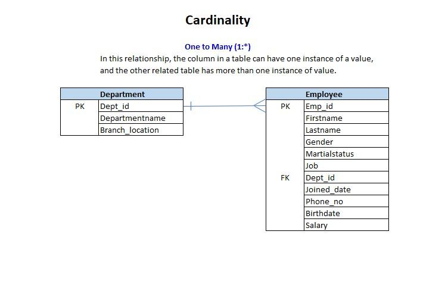
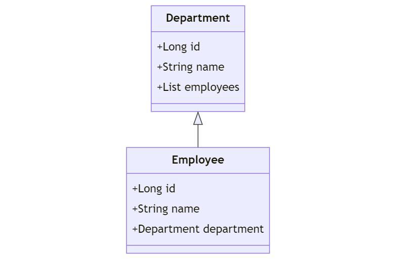
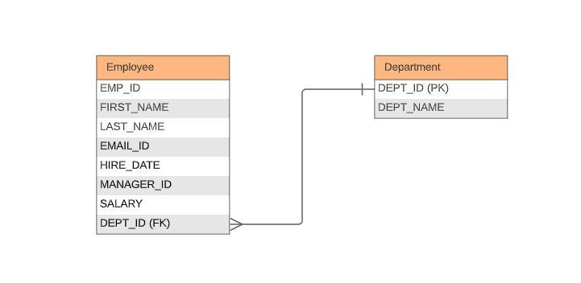
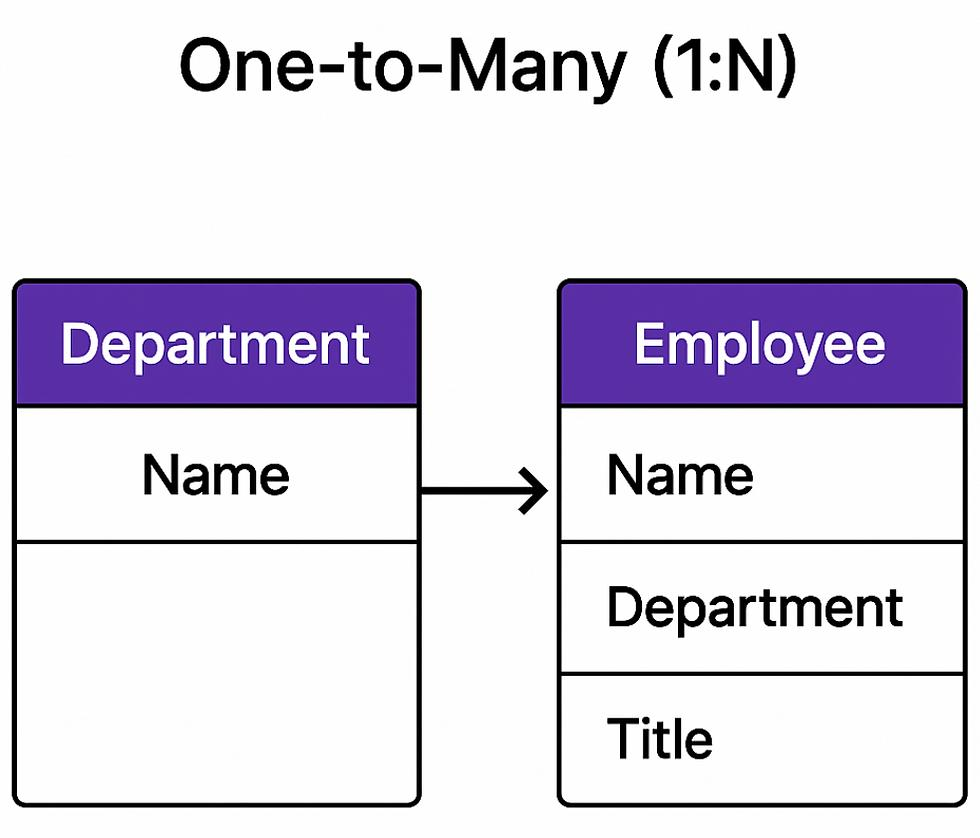

## Q: Explain Spring Data JPA One-to-Many in simple terms

You're right on spot. Let's keep it very simple.

### 1. What does One-to-Many mean?

**One entity has many entities.**

For example:

> **One Department → Many Employees**

A department can have many employees, but each employee belongs to one department.









Think of it like:

```text
Department
   |
   +--- Employee 1
   |
   +--- Employee 2
   |
   +--- Employee 3
```

---

## Q: How do we represent this in Java?

We have two entities:

```java
@Entity
public class Department {

    @Id
    @GeneratedValue
    private Long id;

    private String name;

    @OneToMany
    private List<Employee> employees;
}
```

And:

```java
@Entity
public class Employee {

    @Id
    @GeneratedValue
    private Long id;

    private String name;
}
```

The important part is:

```java
@OneToMany
private List<Employee> employees;
```

It means:

> "One Department can have many Employees."

---

# Q: Where does the relationship actually get stored in the database?

This is the **most important concept**.

Suppose we have:

```text
Department
---------
id
name

Employee
---------
id
name
department_id
```

The `employee` table can have:

```text
id    name      department_id
-----------------------------
1     John      10
2     Bob       10
3     Alice     10
```

Here:

```text
department_id = 10
```

means all three employees belong to department `10`.

So the relationship is essentially:

```text
Department 10
     |
     +---- Employee 1
     +---- Employee 2
     +---- Employee 3
```

---

# Q: How do we normally map this in JPA?

The better/common approach is to make `Employee` the **owning side**.

### Department

```java
@Entity
public class Department {

    @Id
    @GeneratedValue
    private Long id;

    private String name;

    @OneToMany(mappedBy = "department")
    private List<Employee> employees;
}
```

### Employee

```java
@Entity
public class Employee {

    @Id
    @GeneratedValue
    private Long id;

    private String name;

    @ManyToOne
    @JoinColumn(name = "department_id")
    private Department department;
}
```

Now notice:

```java
Department
    ↓
@OneToMany
List<Employee>
```

and:

```java
Employee
    ↓
@ManyToOne
Department
```

So the relationship is actually:

```text
Department 1 -------- * Employee
```

---

# Q: Why do we need both `@OneToMany` and `@ManyToOne`?

Because they represent **two different directions**.

### Department → Employees

```java
@OneToMany
private List<Employee> employees;
```

Meaning:

> "Give me all employees of this department."

### Employee → Department

```java
@ManyToOne
private Department department;
```

Meaning:

> "Give me the department to which this employee belongs."

Therefore:

```text
Department
    |
    | @OneToMany
    ↓
Employees
    |
    | @ManyToOne
    ↓
Department
```

This is called a **bidirectional relationship**.

---

# Q: What does `mappedBy = "department"` mean?

This is another important concept.

```java
@OneToMany(mappedBy = "department")
private List<Employee> employees;
```

`department` refers to the field in `Employee`:

```java
@ManyToOne
private Department department;
```

So:

```text
mappedBy = "department"
             ↑
      Employee's field
```

It basically tells JPA:

> "The Employee entity manages the actual database relationship. Don't create another relationship for Department."

That's why `Employee` is called the **owning side**.

---

# Q: Why is `@ManyToOne` usually the owning side?

Because the foreign key lives in the **Employee table**:

```text
Employee
-------------------------
id
name
department_id  ← FK
```

Therefore, `Employee` controls the relationship.

```java
@ManyToOne
@JoinColumn(name = "department_id")
private Department department;
```

`@JoinColumn` tells JPA:

> "The foreign key is `department_id`."

---

# Q: How would I save an employee?

For example:

```java
Department department = new Department();
department.setName("IT");

Employee employee = new Employee();
employee.setName("John");

employee.setDepartment(department);

employeeRepository.save(employee);
```

Conceptually, the database becomes:

```text
Department
----------------
id = 1
name = IT

Employee
-------------------------
id = 1
name = John
department_id = 1
```

---

# Q: What is the simplest way to remember One-to-Many?

Remember this:

```text
One Department
      ↓
Many Employees
```

In JPA:

```java
Department
    @OneToMany
        ↓
    List<Employee>
```

And on the other side:

```java
Employee
    @ManyToOne
        ↓
    Department
```

### The key rule

> **The `@ManyToOne` side normally owns the relationship because the foreign key is stored there.**

So for interviews, remember:

```text
Department 1 -------- * Employee

Department → @OneToMany
Employee   → @ManyToOne
Employee   → owns the relationship
Employee table → contains department_id
```

This is the foundation. **Next, the important topics are `cascade`, `orphanRemoval`, `fetch`, and why `mappedBy` is needed**—these are where One-to-Many becomes slightly tricky in real Spring Boot applications.
