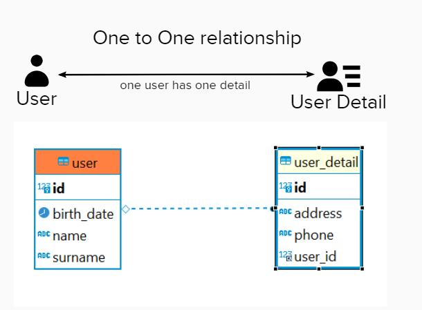
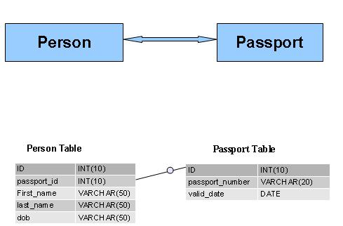
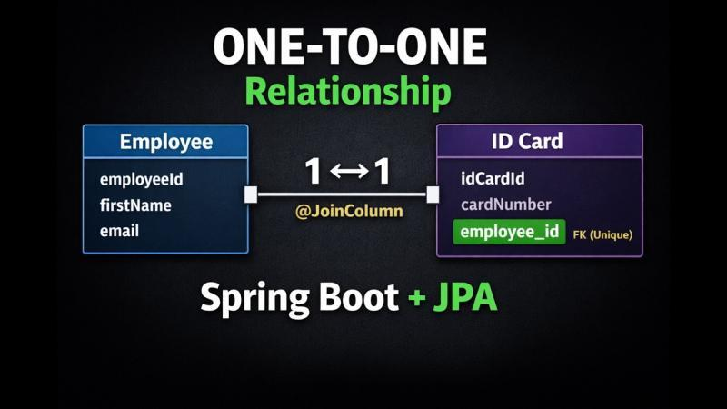
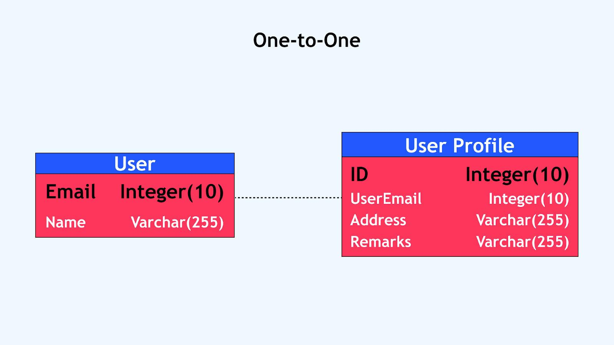

# Q: Explain Spring Data JPA One-to-One in simple terms

You're right on spot. Let's keep it very simple.

## 1. What does One-to-One mean?

**One record in Table A is associated with exactly one record in Table B.**

For example:

> **One User → One Passport**

A user has one passport, and a passport belongs to one user.









---

## 2. Database example

Imagine two tables:

### `users`

| id  | name   |
| --- | ------ |
| 1   | Deepak |
| 2   | Rahul  |

### `passports`

| id  | passport_number | user_id |
| --- | --------------- | ------- |
| 101 | ABC123          | 1       |
| 102 | XYZ456          | 2       |

Here:

```text
User
  |
  | 1 : 1
  |
Passport
```

The `user_id` in the `passports` table is the **foreign key**.

---

# 3. How do we represent this in JPA?

We create two entities.

### User

```java
@Entity
public class User {

    @Id
    @GeneratedValue
    private Long id;

    private String name;

    @OneToOne
    private Passport passport;
}
```

### Passport

```java
@Entity
public class Passport {

    @Id
    @GeneratedValue
    private Long id;

    private String passportNumber;
}
```

That's the basic idea.

Spring Data JPA/Hibernate will understand:

> `User` has a one-to-one relationship with `Passport`.

---

# 4. But where is the foreign key?

This is an **important concept**.

If we write:

```java
@OneToOne
private Passport passport;
```

JPA will normally create something conceptually like:

```text
users
----------------
id
name
passport_id  <-- FK
```

So:

```text
users
   |
   | passport_id
   ↓
passports
```

We can explicitly tell JPA which column should be used:

```java
@OneToOne
@JoinColumn(name = "passport_id")
private Passport passport;
```

Now it is very clear:

```text
users
----------------
id
name
passport_id
          |
          ↓
      passports
```

---

# 5. What does `@JoinColumn` mean?

Think of:

```java
@JoinColumn(name = "passport_id")
```

as:

> **"Use this column to connect the two tables."**

So:

```java
@OneToOne
@JoinColumn(name = "passport_id")
private Passport passport;
```

means:

> User has one Passport, and `passport_id` in the User table points to that Passport.

---

# 6. What about the other side?

We can also make the relationship bidirectional.

### User

```java
@Entity
public class User {

    @Id
    @GeneratedValue
    private Long id;

    private String name;

    @OneToOne
    @JoinColumn(name = "passport_id")
    private Passport passport;
}
```

### Passport

```java
@Entity
public class Passport {

    @Id
    @GeneratedValue
    private Long id;

    private String passportNumber;

    @OneToOne(mappedBy = "passport")
    private User user;
}
```

Now we have:

```text
User
  |
  | passport
  ↓
Passport
  |
  | user
  ↓
User
```

This is called a **bidirectional relationship**.

---

# 7. What does `mappedBy` mean?

This is one of the most important things to understand.

```java
@OneToOne(mappedBy = "passport")
private User user;
```

`mappedBy` means:

> **"I am NOT responsible for managing the relationship. The other entity manages it."**

Here:

```java
User
```

owns the relationship because it has:

```java
@JoinColumn(name = "passport_id")
```

Therefore:

```java
Passport
```

uses:

```java
mappedBy = "passport"
```

So:

```text
User
 └── passport
      └── @JoinColumn  ← OWNER

Passport
 └── user
      └── mappedBy     ← NOT OWNER
```

### Easy rule to remember

> **`@JoinColumn` → owner**

> **`mappedBy` → inverse/non-owning side**

---

# 8. Unidirectional vs Bidirectional

There are two common ways.

### Unidirectional

Only User knows about Passport:

```java
User → Passport
```

```java
@OneToOne
@JoinColumn(name = "passport_id")
private Passport passport;
```

You can do:

```java
user.getPassport();
```

But Passport doesn't know about User.

---

### Bidirectional

Both know about each other:

```text
User ↔ Passport
```

User:

```java
@OneToOne
@JoinColumn(name = "passport_id")
private Passport passport;
```

Passport:

```java
@OneToOne(mappedBy = "passport")
private User user;
```

Now:

```java
user.getPassport();
```

and:

```java
passport.getUser();
```

both work.

---

# 9. What happens when we save?

Suppose:

```java
Passport passport = new Passport();
passport.setPassportNumber("ABC123");

User user = new User();
user.setName("Deepak");
user.setPassport(passport);
```

Then:

```java
userRepository.save(user);
```

Depending on the cascade configuration, JPA can persist the Passport as well.

For example:

```java
@OneToOne(cascade = CascadeType.ALL)
@JoinColumn(name = "passport_id")
private Passport passport;
```

`CascadeType.ALL` means operations on User can cascade to Passport.

For example:

```text
save(User)
   ↓
save(Passport)

delete(User)
   ↓
delete(Passport)
```

Be careful with `CascadeType.ALL`, especially with shared entities.

---

# 10. What does `optional = false` mean?

Suppose every User **must** have a Passport.

You can say:

```java
@OneToOne(optional = false)
@JoinColumn(name = "passport_id", nullable = false)
private Passport passport;
```

Conceptually:

```text
User
  |
  └── Passport is REQUIRED
```

Whereas:

```java
@OneToOne
private Passport passport;
```

means the relationship can potentially be absent:

```text
User
  |
  └── Passport may or may not exist
```

---

# 11. One important real-world point

A **true one-to-one relationship** is actually less common than you might initially think.

For example:

```text
User → Address
```

could be one-to-one.

But often:

```text
User → Orders
```

is actually:

```text
One User → Many Orders
```

which is:

```java
@OneToMany
```

So don't automatically use `@OneToOne` just because two entities are related.

---

# 12. The mental model you should remember

Think of it like this:

```text
@OneToOne
       ↓
"One object is related to one other object"
```

And:

```java
@JoinColumn
```

means:

```text
"I own the relationship and this column connects us."
```

While:

```java
mappedBy
```

means:

```text
"I am the other side.
The other entity owns the relationship."
```

### Most important example

```java
@Entity
class User {

    @OneToOne
    @JoinColumn(name = "passport_id")
    private Passport passport;
}
```

```java
@Entity
class Passport {

    @OneToOne(mappedBy = "passport")
    private User user;
}
```

Think:

```text
              owns relationship
                     ↓
User ───────────── Passport
  │
  └── passport_id (FK)

Passport
  │
  └── mappedBy = "passport"
```

**Next important topic:** `@OneToOne` has several variations that are worth understanding one by one: **foreign-key mapping, shared primary-key mapping (`@MapsId`), `mappedBy`, cascade, and fetch (`LAZY` vs `EAGER`)**.
